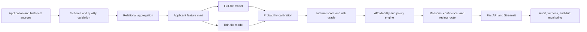

# Architecture

## Logical flow

## Runtime boundaries

### Core domain

`credifast.domain`, `credifast.scoring`, `credifast.policy`, and `credifast.service` are independent of HTTP and UI frameworks. They own validation, scoring contracts, score mapping, affordability, decisioning, and reason codes.

### Model adapter

The current scorer is a deterministic baseline. A later `ModelScorer` implementation will load a frozen preprocessing pipeline, LightGBM artifact, calibrator, feature schema, and reason-code mapping. It must return the same `RiskAssessment` contract.

### API adapter

`credifast.api` maps Pydantic request models to the core domain. It must not reproduce decision rules.

### UI adapter

`ui/app.py` calls the core service for local demonstration. It must not calculate scores independently.

## Artifact bundle

The trained model release will bundle:

- feature schema and order;
- preprocessing/version metadata;
- full-file and thin-file model files;
- probability calibrators;
- reason-code mapping;
- model card;
- data/split/model metrics;
- artifact hashes.

## Version fields

Every assessment must eventually record:

- dataset version;
- feature version;
- model version;
- calibration version;
- policy version;
- explanation version;
- scoring timestamp and request ID.

## Security boundary

- Applicant identifiers are external references, not model features.
- Raw personal fields must not appear in application logs.
- Model artifacts never contain raw training records.
- Kaggle data remains local and ignored by Git.
- Authentication and role-based authorization sit ahead of the API in production.
